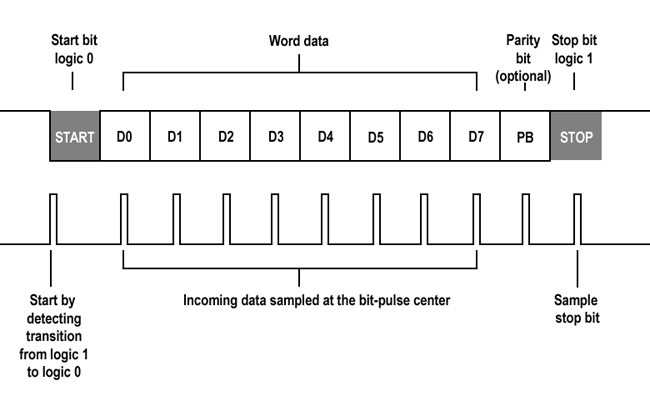

## **Aim** 

To implement and demonstrate UART transmission communication protocol on ARTIX 7 FPGA board for serial data transmission.

## **List of equipments**

Vivado IDE, PC Nexys A7 development board 

## **Theoretical Background** 

### **UART**

The Universal Asynchronous Receiver-Transmitter (UART) protocol is a widely used method for serial communication between digital devices. Unlike synchronous protocols, UART does not require a shared clock signal between the transmitter and receiver, making it suitable for asynchronous communication. In UART, data is transmitted in frames consisting of a start bit, a fixed number of data bits (typically 8 bits), an optional parity bit for error detection, and one or more stop bits. The start bit indicates the beginning of the frame and is always a logic low (0), while the stop bit(s) signal the end of the frame and are always logic high (1). The data bits carry the actual information being transmitted, with each bit representing a binary value. Parity bit, if used, is used for error checking purposes; it can be set to odd, even, or no parity to ensure data integrity. The absence of a shared clock means that the transmitter and receiver must agree on a baud rate, which determines the rate at which bits are transmitted.

### **Nexys A7**

The Digilent Nexys A7 is a development board featuring a Xilinx Artix-7 FPGA for learning and implementing digital circuits. It boasts additional processing power with Block RAM and internal clock speeds exceeding 450 MHz. For connectivity, it includes a 10/100 Mbps Ethernet port, a microSD card slot, four Pmod ports for expansion, and a 12-bit VGA output.  What truly enhances the Nexys A7's functionality is the rich set of on-board peripherals, including user input/output elements like push buttons, LEDs (including tri-color), and seven-segment displays and PMOD connectors to connect the board with external sensors and actuators. It also features audio capabilities with a microphone, speaker amplifier, and PWM audio output. Additionally, the Nexys A7 integrates sensors like a temperature sensor and a 3-axis accelerometer.

### **PuTTY**

PuTTY is a free, open-source terminal emulator, serial console, and network file transfer application. Widely used in the IT community, PuTTY supports various network protocols such as SSH, Telnet, and raw socket connections. Its lightweight design and cross-platform compatibility make it a popular choice for managing remote systems and network devices.

## **System diagram**

![screenshot2][image3]  
In this project we are using a feeder mechanism which will feed the string data in bytes to uart module upon receiving rx\_ready button assertion. It will observe other flags of uart like active, done , ready for further increment in byte index and thus it will send a string of length len till it reaches the last character of the string. Once the length counter exceeds the length of the string it will stop feeding the characters. This will result in displaying the string only once.

## **Process State Diagram**

![screenshot3][image4.png]

Dv —-----\> data valid signal( i\_Tx\_DV )  
rx\_ready—\> receiver ready signal ( r\_ready )  
baud\_cycles—\> max value counter should reach to generate baudrate       (CLKS\_PER\_BIT-1)  
baud\_cycles=system\_clock\_frequency/desired baud rate   
COUNTER —\> r\_Clock\_Count

### **EXPLANATION**

**Initialization:**  
o\_Tx\_Done and o\_Tx\_Active are set to 0 at the beginning.  
State Machine:  
The module operates on a state machine with six states represented by r\_SM\_Main.  
The states are defined as parameters for readability (s\_IDLE, s\_TX\_START\_BIT, s\_TX\_DATA\_BITS, s\_TX\_STOP\_BIT, s\_CLEANUP).  
r\_SM\_Main determines the current state of the UART transmitter.

**Idle State (s\_IDLE):**  
The UART waits in this state until i\_Tx\_DV (data valid) is high and r\_ready (receiver ready) is high.  
When both conditions are met, the UART proceeds to transmit data.  
If the conditions are not met, it stays in the idle state.(DATA=HIGH)

**Start Bit Transmission (s\_TX\_START\_BIT):**  
The UART starts transmitting data by driving the serial line low (start bit).  
It waits for a number of clock cycles (CLKS\_PER\_BIT \- 1\) to finish transmitting the start bit. After transmitting the start bit, it moves to the next state.

**Data Bit Transmission (s\_TX\_DATA\_BITS):**  
The UART transmits each data bit (data\_Byte) sequentially, starting from the least significant bit. It waits for a number of clock cycles (CLKS\_PER\_BIT \- 1\) for each data bit to be transmitted.(BAUD RATE).  After transmitting all data bits, it moves to the next state.

**Stop Bit Transmission (s\_TX\_STOP\_BIT):**  
The UART transmits the stop bit by driving the serial line high.  
It waits for a number of clock cycles (CLKS\_PER\_BIT \- 1\) to finish transmitting the stop bit.  
After transmitting the stop bit, it sets o\_Tx\_Done to signal that transmission is complete and moves to the cleanup state.

**Cleanup State (s\_CLEANUP):**  
In this state, o\_Tx\_Active is set to 0 to indicate that the UART is no longer actively transmitting.  
o\_Tx\_Done remains high to indicate that the transmission process is complete.  
Finally, the UART returns to the idle state to wait for the next transmission request.

**Output Signals:**  
o\_Tx\_Serial represents the UART serial output line.  
o\_Tx\_ready is assigned as the negation of o\_Tx\_Active, indicating whether the UART is ready to accept new data for transmission.

### **Explanation**

**Initialization:**  
When the module is reset (rst is asserted), it initializes internal counters and loads the first byte of data from the data buffer into data\_Byte.

**Clock-triggered State Management:**  
On each positive edge of the clock (i\_Clock), or when the reset signal (rst) transitions from high to low, the module progresses through its states.

**Data Transmission State:**  
While the module is not in the reset state (rst \== 1'b0), and the counter (counter) is less than the string length (strlen), and the receiver is ready (r\_ready), it enters the data transmission state.  
If data transmission is not completed (\!o\_Tx\_done), the module checks if the UART is ready to receive data (o\_Tx\_ready).  
If the UART is ready, it sets the i\_Tx\_DV signal to 1, indicating valid data to transmit.  
If the UART is not ready, it keeps the i\_Tx\_DV signal low, indicating no data transmission.  
If data transmission is completed (o\_Tx\_done \== 1'b1), the module proceeds to the next byte of data.  
If the UART is not ready to receive data (\!o\_Tx\_ready), it shifts the data buffer (data\_buff) to the left by 8 bits and increments the counter (counter).  
If the UART is ready to receive data, it updates data\_Byte with the next byte from the data buffer.

**UART Integration:**  
The feeder interacts with the UART module (uart) by providing input signals (data\_Byte, r\_ready) and monitoring output signals (o\_Tx\_ready, o\_Tx\_done).  
It ensures that data transmission occurs only when the UART is ready to receive data and handles the shifting of the data buffer once a byte is successfully transmitted.

## **PuTTY installation**

### **Step 1:**

Open the following link in a browser [https://www.chiark.greenend.org.uk/\~sgtatham/putty/latest.html](https://www.chiark.greenend.org.uk/~sgtatham/putty/latest.html)

### **Step 2:**

A download page opens (as shown above). Select the 64-bit/32-bit version according to your windows system. Once you select, it’ll start downloading the installer executable file automatically.

### **Step 3:**

Once the download is completed, open the directory where the installer executable file is downloaded. Double click on that.

### **Step 4:**

Once you open the installer executable, a window will appear. Click next.

### **Step 5:**

Now it asks for the destination directory in which software to be installed. Use the Change option to select the folder you want the PuTTY to be installed in. Then click Next.

![screenshot][image6]

### **Step 6:**

Product features selection page will open . Click Install.

![screenshot][image7]

Note: windows may prompt to confirm the installation of the PuTTY along with its details. Click Yes.

### **Step 7:**

Wait till installation completes.  
Once the installation completes, click Finish .  
![screenshot][image8]

## **Constraint Files**

Open the following URL in your browser and download the file from github.  
[https://github.com/Digilent/digilent-xdc/blob/master/Nexys-A7-100T-Master.xdc](https://github.com/Digilent/digilent-xdc/blob/master/Nexys-A7-100T-Master.xdc)  
It’ll be used while we configure I/O pins. 

## **Steps To Perform Experiment**

### **Project file**

#### **Step 1:**

Open Vivado and create a new project.

#### **Step 2:**

Create feeder and transmitter design source files using above given codes.

#### **Step 3:**

Add downloaded constraint file to the project using  Add files option

#### **Step 4:**

Select the constraint file in Sources panel and open it in the editor by double clicking it.

![screenshot][image9]
#### **Step 5:** 

Here we are configuring the I/O pins.  
First let us specify the clock pin. Uncomment the 7th line and replace the word CLK100MHZ with i\_Clock .   
(This means we are telling vivado to set the pin which is connected to the crystal oscillator as clock input to our project. Like this we map all the I/O  pins from our source file to appropriate physical pins.)

#### **Step 6:**

Similarly specify for tx\_active and tx\_done indicator LED’s.(line no. 30,31)  
![screenshot][image10]

#### **Step 7:** 

Similarly specify for reset and receiver ready buttons.(line no. 77,78)  
![screenshot][image11]

#### **Step 8:**

Now let’s specify pin for UART tx.(line no. 186\) . And save the file.![][image12]

### **Generating Bitstream and Programming**

#### **Step 1:**

Scroll down the Flow Navigator panel and find the option Generate Bitstream . And double click on that. It’ll automatically complete the synthesis and implementation part. And finally generates the ready to upload .bit file . This process may take several minutes .

#### 

#### **Step 2**

When bitstream generation completes it’ll be prompted to open the hardware manager. Before opening the hardware manager, let's connect the FPGA board to pc using USB cable.  
![screenshot][image13]

#### **Step 3:**

Connect the nexys board to pc using USB cable  
![screenshot][image14]

#### **Step 4:**

Open the Hardware Manager in Vivado. It shows unconnected .  
Select “open target” option, double click on  ”Auto Connect”. 

#### **Step 5:** 

Click on Program device option. It’ll program the bitstream into FPGA.

### **UART**

#### **Step 1:** 

Open Device manager in windows and find to which COM port the FPGA is connected. 

#### **Step 2:**

Open PuTTY

#### **Step 3:**

Select “Serial” option for serial communication  
![screenshot][image15]

Here, enter the COM port, speed as 115200, and click open. It’ll open a terminal.

#### **Step 4:**

PC ready button  
Reset button

Here the central button is to reset the program. Upper button to be pressed when pc is ready to receive the program.   
Press the central button first and then press the upper button. You’ll get the UART output on PuTTY terminal.

### **Results**

![screenshot][image16]  
UART module:  
It is responsible for handling protocol. It’ll generate the baud rate by dividing the system clock frequency (clock divider technique). In our case, we have set the baud rate to 115200 and accordingly count the counter values while sending the actual bits to generate the baud rate.

Feeder module: It is responsible for loading the data and handling I/O parts. Also it is responsible for stopping the transmission once it is sent.  

